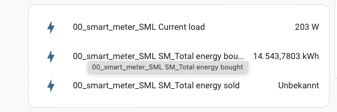

# ESPHome-SML-OBIS-Reader
ESPHome configuration example to read Power Meter via IR TTL (Volkszähler)

I'm using an Wemos D1 Mini and a IR Transmitter, 1k Ohm Transistor and some wires. 

This configuration works for me with my ED100L Smart Meter from EMH.

If needed change your obis_code accordingly to your Power Meters provided values.
To see which obis_code's are sent from your power meter, you can simply set the log level for sml to DEBUG.

# Device view in Home Assistant

# finished 3D Print with ESP8266 
see https://alkly.de/smart-meter-auslesen-mit-tasmota-esphome/

